# Jarkom-Modul-2-2026-K-19
## Anggota Kelompok
| Nama | NRP |
| --- | --- |
| Ni Putu Maqueenta Wijaya | 5027251004 |
| Malikha Syafira Dewi | 5027251032 |
## Pembahasan
## Soal 1
Membuat topologi sesuai yang diminta soal
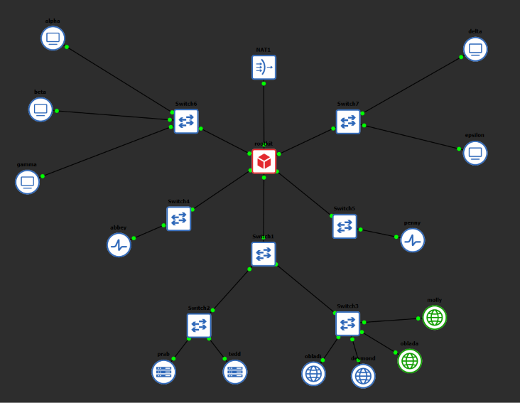<br>
Konfigurasi Node:
1. Rootkit
```bash
auto lo
iface lo inet loopback

# Connection to NAT
auto eth0
iface eth0 inet dhcp

# Switch 1 (Directory & Repository)
auto eth1
iface eth1 inet static
    address 10.73.10.1
    netmask 255.255.255.0

# Switch 4 (Penyaring Abbey)
auto eth2
iface eth2 inet static
    address 10.73.20.1
    netmask 255.255.255.0

# Switch 5 (Penyaring Penny)
auto eth3
iface eth3 inet static
    address 10.73.30.1
    netmask 255.255.255.0

# Switch 6 (Operator Alpha, Beta, Gamma)
auto eth4
iface eth4 inet static
    address 10.73.40.1
    netmask 255.255.255.0

# Switch 7 (Operator Delta, Epsilon)
auto eth5
iface eth5 inet static
    address 10.73.50.1
    netmask 255.255.255.0
```
2. Alpha
```bash
auto lo
iface lo inet loopback

auto eth0
iface eth0 inet static
    address 10.73.40.2
    netmask 255.255.255.0
    gateway 10.73.40.1
    up echo "nameserver 192.168.122.1" > /etc/resolv.conf
```
3. Beta
```bash
auto lo
iface lo inet loopback

auto eth0
iface eth0 inet static
    address 10.73.40.3
    netmask 255.255.255.0
    gateway 10.73.40.1
    up echo "nameserver 192.168.122.1" > /etc/resolv.conf
```
4. Gamma
```bash
auto lo
iface lo inet loopback

auto eth0
iface eth0 inet static
    address 10.73.40.4
    netmask 255.255.255.0
    gateway 10.73.40.1
    up echo "nameserver 192.168.122.1" > /etc/resolv.conf
```
5. Delta
```bash
auto lo
iface lo inet loopback

auto eth0
iface eth0 inet static
    address 10.73.50.2
    netmask 255.255.255.0
    gateway 10.73.50.1
    up echo "nameserver 192.168.122.1" > /etc/resolv.conf
```
6. Epsilon
```bash
auto lo
iface lo inet loopback

auto eth0
iface eth0 inet static
    address 10.73.50.3
    netmask 255.255.255.0
    gateway 10.73.50.1
    up echo "nameserver 192.168.122.1" > /etc/resolv.conf
```
7. Abbey
```bash
auto lo
iface lo inet loopback

auto eth0
iface eth0 inet static
    address 10.73.20.2
    netmask 255.255.255.0
    gateway 10.73.20.1
    up echo "nameserver 192.168.122.1" > /etc/resolv.conf
```
8. Penny
```bash
auto lo
iface lo inet loopback

auto eth0
iface eth0 inet static
    address 10.73.30.2
    netmask 255.255.255.0
    gateway 10.73.30.1
    up echo "nameserver 192.168.122.1" > /etc/resolv.conf
```
9. Prab
```bash
auto lo
iface lo inet loopback

auto eth0
iface eth0 inet static
    address 10.73.10.2
    netmask 255.255.255.0
    gateway 10.73.10.1
    up echo "nameserver 192.168.122.1" > /etc/resolv.conf
```
10. Tedd
```bash
auto lo
iface lo inet loopback

auto eth0
iface eth0 inet static
    address 10.73.10.3
    netmask 255.255.255.0
    gateway 10.73.10.1
    up echo "nameserver 192.168.122.1" > /etc/resolv.conf
```
11. Obladi
```bash
auto lo
iface lo inet loopback

auto eth0
iface eth0 inet static
    address 10.73.10.4
    netmask 255.255.255.0
    gateway 10.73.10.1
    up echo "nameserver 192.168.122.1" > /etc/resolv.conf
```
12. Desmond
```bash
auto lo
iface lo inet loopback

auto eth0
iface eth0 inet static
    address 10.73.10.5
    netmask 255.255.255.0
    gateway 10.73.10.1
    up echo "nameserver 192.168.122.1" > /etc/resolv.conf
```
13. Oblada
```bash
auto lo
iface lo inet loopback

auto eth0
iface eth0 inet static
    address 10.73.10.6
    netmask 255.255.255.0
    gateway 10.73.10.1
    up echo "nameserver 192.168.122.1" > /etc/resolv.conf
```
14. Molly
```bash
auto lo
iface lo inet loopback

auto eth0
iface eth0 inet static
    address 10.73.10.7
    netmask 255.255.255.0
    gateway 10.73.10.1
    up echo "nameserver 192.168.122.1" > /etc/resolv.conf
```
## Soal 2
Mengaktifkan routing dan NAT di Rootkit
```bash
sysctl -w net.ipv4.ip_forward=1
iptables -F
iptables -t nat -F
iptables -t nat -A POSTROUTING -o eth0 -j MASQUERADE
iptables -A FORWARD -j ACCEPT
```
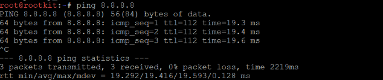<br>
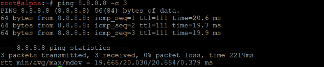<br>
## Soal 3
Membuat divisi/subnet internal terhubung satu sama lain dan bisa mengakses internet. Hal ini bisa dilakukan dengan menambahkan konfigurasi berikut ke semua node non-router (selain rootkit).
```bash
up echo "nameserver 192.168.122.1" > /etc/resolv.conf
```
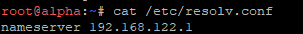<br>
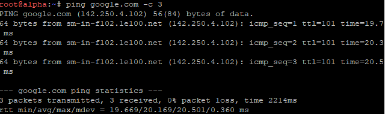<br>
## Soal 4
Pertama-tama set hostname ke seluruh node terlebih dahulu
```bash
hostname rootkit && echo "rootkit" > /etc/hostname
hostname prab && echo "prab" > /etc/hostname
hostname tedd && echo "tedd" > /etc/hostname
hostname alpha && echo "alpha" > /etc/hostname
hostname beta && echo "beta" > /etc/hostname
hostname gamma && echo "gamma" > /etc/hostname
hostname delta && echo "delta" > /etc/hostname
hostname epsilon && echo "epsilon" > /etc/hostname
hostname abbey && echo "abbey" > /etc/hostname
hostname penny && echo "penny" > /etc/hostname
hostname obladi && echo "obladi" > /etc/hostname
hostname desmond && echo "desmond" > /etc/hostname
hostname oblada && echo "oblada" > /etc/hostname
hostname molly && echo "molly" > /etc/hostname
```
Selanjutnya download bind9 di node Prab
```bash
apt update -o Acquire::ForceIPv4=true
apt install bind9 dnsutils -y -o Acquire::ForceIPv4=true
```
Kemudian konfigurasi node Prab sebagai DNS Master
```bash
cat << 'EOF' > /etc/bind/named.conf.options
options {
        directory "/var/cache/bind";

        forwarders {
                192.168.122.1;
        };

        dnssec-validation auto;
        listen-on-v6 { any; };
};
EOF

cat << 'EOF' > /etc/bind/named.conf.local
zone "k19.com" {
    type master;
    file "/etc/bind/jarkom/k19.com";
    allow-transfer { 10.73.10.3; };
    also-notify { 10.73.10.3; };
    notify yes;
};
EOF

mkdir -p /etc/bind/jarkom

cat << 'EOF' > /etc/bind/jarkom/k19.com
$TTL    604800
@       IN      SOA     prab.k19.com. root.k19.com. (
                        2026092801 ; Serial
                            604800 ; Refresh
                             86400 ; Retry
                           2419200 ; Expire
                            604800 ) ; Negative Cache TTL
;
@       IN      NS      prab.k19.com.
@       IN      NS      tedd.k19.com.

@       IN      A       10.73.30.2   ; IP penny (Apex)
prab    IN      A       10.73.10.2
tedd    IN      A       10.73.10.3

abbey   IN      A       10.73.20.2
penny   IN      A       10.73.30.2

vault   IN      A       10.73.10.4
vault   IN      A       10.73.10.5
core    IN      A       10.73.10.6
core    IN      A       10.73.10.7

www     IN      CNAME   penny.k19.com.
static  IN      CNAME   abbey.k19.com.

alpha   IN      A       10.73.40.2
beta    IN      A       10.73.40.3
gamma   IN      A       10.73.40.4
delta   IN      A       10.73.50.2
epsilon IN      A       10.73.50.3
EOF

chown -R bind:bind /etc/bind/jarkom
service named restart
```

Selanjutnya download bind9 di node Tedd
```bash
apt update -o Acquire::ForceIPv4=true
apt install bind9 dnsutils -y -o Acquire::ForceIPv4=true
```
Kemudian konfigurasi node Tedd sebagai DNS Slave
```bash
cat << 'EOF' > /etc/bind/named.conf.options
options {
        directory "/var/cache/bind";

        forwarders {
                192.168.122.1;
        };

        dnssec-validation auto;
        listen-on-v6 { any; };
};
EOF

cat << 'EOF' > /etc/bind/named.conf.local
zone "k19.com" {
    type slave;
    masters { 10.73.10.2; };
    file "/var/lib/bind/k19.com";
};
EOF

service named restart
```
Terakhir lakukan konfigurasi dan pengujian dari non-router lain (contoh: alpha)
```bash
cat << 'EOF' > /etc/resolv.conf
nameserver 10.73.10.2
nameserver 10.73.10.3
nameserver 192.168.122.1
EOF

# Pengujian
host -t A k19.com
host prab.k19.com
host tedd.k19.com
```
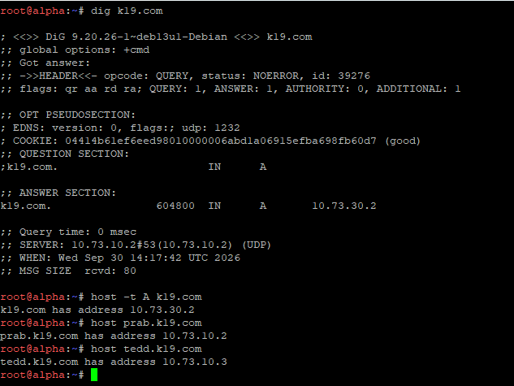<br>
## Soal 5
Pertama jalankan ini di node Prab
```bash
cat << 'EOF' > /etc/bind/jarkom/k19.com
$TTL    604800
@       IN      SOA     prab.k19.com. root.k19.com. (
                        2026092802 ; Serial (Sudah dinaikkan agar Slave Sync)
                            604800 ; Refresh
                             86400 ; Retry
                           2419200 ; Expire
                            604800 ) ; Negative Cache TTL
;
; Name Servers
@       IN      NS      prab.k19.com.
@       IN      NS      tedd.k19.com.

; Apex Domain (Penny)
@       IN      A       10.73.30.2

; --- PENGECUALIAN NODE DNS SERVER ---
prab    IN      A       10.73.10.2
tedd    IN      A       10.73.10.3

; --- DOMAIN ENTITAS INDIVIDUAL ---
rootkit IN      A       10.73.10.1
abbey   IN      A       10.73.20.2
penny   IN      A       10.73.30.2
obladi  IN      A       10.73.10.4
desmond IN      A       10.73.10.5
oblada  IN      A       10.73.10.6
molly   IN      A       10.73.10.7
alpha   IN      A       10.73.40.2
beta    IN      A       10.73.40.3
gamma   IN      A       10.73.40.4
delta   IN      A       10.73.50.2
epsilon IN      A       10.73.50.3

; --- LOAD BALANCING REPOSITORIES ---
vault   IN      A       10.73.10.4
vault   IN      A       10.73.10.5
core    IN      A       10.73.10.6
core    IN      A       10.73.10.7

; --- ALIAS CNAME ---
www     IN      CNAME   penny.k19.com.
static  IN      CNAME   abbey.k19.com.
EOF

service named restart
```
Selanjutnya jalankan ini di Tedd
```bash
rm -f /var/lib/bind/k19.com
service named restart
```
Terakhir jalankan testing di node lain (contoh: Alpha)
```bash
host alpha.k19.com
host delta.k19.com
host obladi.k19.com
host molly.k19.com
```
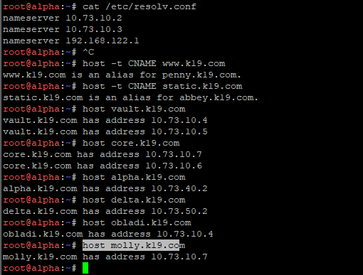<br>
## Soal 6
Jalankan perintah berikut di node Alpha
```bash
host -t SOA k19.com 10.73.10.2
host -t SOA k19.com 10.73.10.3
```
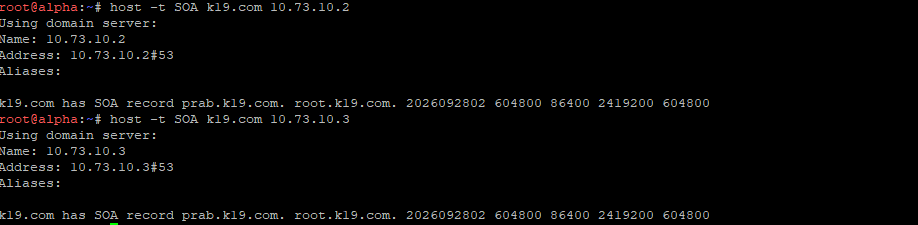<br>
## Soal 7
Pertama, konfigurasi node Prab dengan menaikkan nomor serial SOA
```bash
cat << 'EOF' > /etc/bind/jarkom/k19.com
$TTL    604800
@       IN      SOA     prab.k19.com. root.k19.com. (
                        2026092803 ; Serial (Naikkan angka serial)
                            604800 ; Refresh
                             86400 ; Retry
                           2419200 ; Expire
                            604800 ) ; Negative Cache TTL
;
; Name Servers
@       IN      NS      prab.k19.com.
@       IN      NS      tedd.k19.com.

; Apex Domain (Penny)
@       IN      A       10.73.30.2

; Host Utama BIND9
prab    IN      A       10.73.10.2
tedd    IN      A       10.73.10.3

; Gerbang Utama / Reverse Proxy
abbey   IN      A       10.73.20.2
penny   IN      A       10.73.30.2

; Area Vault (Web Statis - Round Robin)
vault   IN      A       10.73.10.4
vault   IN      A       10.73.10.5
obladi  IN      A       10.73.10.4
desmond IN      A       10.73.10.5

; Area Core (Web Dinamis - Round Robin)
core    IN      A       10.73.10.6
core    IN      A       10.73.10.7
oblada  IN      A       10.73.10.6
molly   IN      A       10.73.10.7

; Operator Clients
alpha   IN      A       10.73.40.2
beta    IN      A       10.73.40.3
gamma   IN      A       10.73.40.4
delta   IN      A       10.73.50.2
epsilon IN      A       10.73.50.3

; Alias CNAME
www     IN      CNAME   penny.k19.com.
static  IN      CNAME   abbey.k19.com.
EOF

named-checkzone k19.com /etc/bind/jarkom/k19.com
service named restart
```
Kemudian restart pada node Tedd
```bash
rm -f /var/lib/bind/k19.com
service named restart
```
Terakhir lakukan testing pada node Alpha dan Delta
```bash
cat << 'EOF' > /etc/resolv.conf
nameserver 10.73.10.2
nameserver 10.73.10.3
nameserver 192.168.122.1
EOF

host www.k19.com
host static.k19.com
host vault.k19.com
host core.k19.com
```
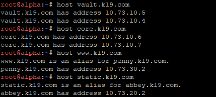<br>
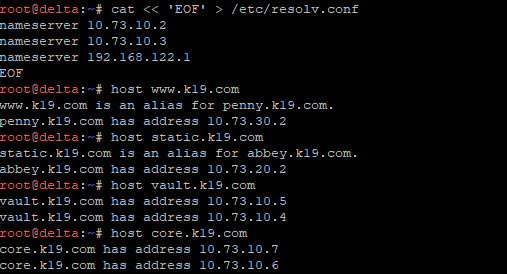<br>
## Soal 8
Pertama tambahkan deklarasi reverse zone di node Prab
```bash
cat << 'EOF' >> /etc/bind/named.conf.local

zone "10.73.10.in-addr.arpa" {
    type master;
    file "/etc/bind/jarkom/10.73.10.in-addr.arpa";
    allow-transfer { 10.73.10.3; };
    also-notify { 10.73.10.3; };
    notify yes;
};

zone "20.73.10.in-addr.arpa" {
    type master;
    file "/etc/bind/jarkom/20.73.10.in-addr.arpa";
    allow-transfer { 10.73.10.3; };
    also-notify { 10.73.10.3; };
    notify yes;
};

zone "30.73.10.in-addr.arpa" {
    type master;
    file "/etc/bind/jarkom/30.73.10.in-addr.arpa";
    allow-transfer { 10.73.10.3; };
    also-notify { 10.73.10.3; };
    notify yes;
};
EOF
```
Selanjutnya buat file database PTR untuk masing-masing reverse zone
```bash
# File Reverse Zone 10.73.10 (Vault & Core)
cat << 'EOF' > /etc/bind/jarkom/10.73.10.in-addr.arpa
$TTL    604800
@       IN      SOA     prab.k19.com. root.k19.com. (
                        2026092801 ; Serial
                            604800 ; Refresh
                             86400 ; Retry
                           2419200 ; Expire
                            604800 ) ; Negative Cache TTL
;
@       IN      NS      prab.k19.com.
@       IN      NS      tedd.k19.com.

2       IN      PTR     prab.k19.com.
3       IN      PTR     tedd.k19.com.
4       IN      PTR     obladi.k19.com.
5       IN      PTR     desmond.k19.com.
6       IN      PTR     oblada.k19.com.
7       IN      PTR     molly.k19.com.
EOF

# File Reverse Zone 20.73.10 (Abbey)
cat << 'EOF' > /etc/bind/jarkom/20.73.10.in-addr.arpa
$TTL    604800
@       IN      SOA     prab.k19.com. root.k19.com. (
                        2026092801 ; Serial
                            604800 ; Refresh
                             86400 ; Retry
                           2419200 ; Expire
                            604800 ) ; Negative Cache TTL
;
@       IN      NS      prab.k19.com.
@       IN      NS      tedd.k19.com.

2       IN      PTR     abbey.k19.com.
EOF

# File Reverse Zone 30.73.10 (Penny)
cat << 'EOF' > /etc/bind/jarkom/30.73.10.in-addr.arpa
$TTL    604800
@       IN      SOA     prab.k19.com. root.k19.com. (
                        2026092801 ; Serial
                            604800 ; Refresh
                             86400 ; Retry
                           2419200 ; Expire
                            604800 ) ; Negative Cache TTL
;
@       IN      NS      prab.k19.com.
@       IN      NS      tedd.k19.com.

2       IN      PTR     penny.k19.com.
EOF
```
Restart
```bash
chown -R bind:bind /etc/bind/jarkom
service named restart
```
Selanjutnya deklarasi ketiga reverse zone sebagai type slave di node Tedd
```bash
cat << 'EOF' >> /etc/bind/named.conf.local

zone "10.73.10.in-addr.arpa" {
    type slave;
    masters { 10.73.10.2; };
    file "/var/lib/bind/10.73.10.in-addr.arpa";
};

zone "20.73.10.in-addr.arpa" {
    type slave;
    masters { 10.73.10.2; };
    file "/var/lib/bind/20.73.10.in-addr.arpa";
};

zone "30.73.10.in-addr.arpa" {
    type slave;
    masters { 10.73.10.2; };
    file "/var/lib/bind/30.73.10.in-addr.arpa";
};
EOF
```
Restart
```bash
rm -f /var/lib/bind/*.in-addr.arpa
service named restart
```
Terakhir lakukan pengujian di node Alpha
```bash
host 10.73.10.4
host 10.73.10.5
host 10.73.10.6
host 10.73.10.7

host 10.73.20.2
host 10.73.30.2
```
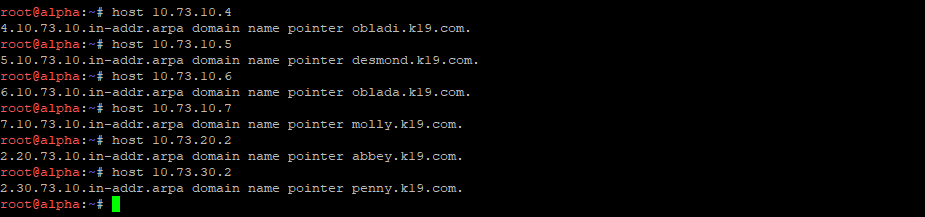<br>
## Soal 9
Pertama lakukan konfigurasi di Obladi
```bash
apt update -o Acquire::ForceIPv4=true
apt install apache2 -y -o Acquire::ForceIPv4=true

# Buat direktori dan file sampel
mkdir -p /var/www/html/arsip
echo "File Arsip Vault Obladi 1" > /var/www/html/arsip/berkas1.txt
echo "File Arsip Vault Obladi 2" > /var/www/html/arsip/berkas2.txt

# Konfigurasi Autoindex untuk folder /arsip/
cat << 'EOF' > /etc/apache2/conf-available/arsip-autoindex.conf

    Options +Indexes

EOF
```
Aktifkan konfigurasi di Oblada
```bash
a2enconf arsip-autoindex
apachectl configtest
service apache2 restart
```
Kemdian lakukan konfigurasi di Desmond
```bash
apt update -o Acquire::ForceIPv4=true
apt install apache2 -y -o Acquire::ForceIPv4=true

# Buat direktori dan file sampel
mkdir -p /var/www/html/arsip
echo "File Arsip Vault Desmond 1" > /var/www/html/arsip/berkas1.txt
echo "File Arsip Vault Desmond 2" > /var/www/html/arsip/berkas2.txt

# Konfigurasi Autoindex untuk folder /arsip/
cat << 'EOF' > /etc/apache2/conf-available/arsip-autoindex.conf

    Options +Indexes

EOF
```
Aktifkan konfigurasi di Desmond
```bash
a2enconf arsip-autoindex
apachectl configtest
service apache2 restart
```
Terakhir lakukan testing di Alpha
```bash
curl -s http://obladi.k19.com/arsip/
curl -s http://desmond.k19.com/arsip/
curl -s http://vault.k19.com/arsip/
```
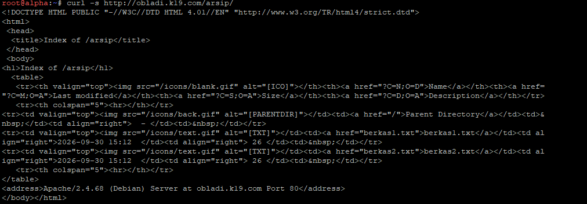 <br>
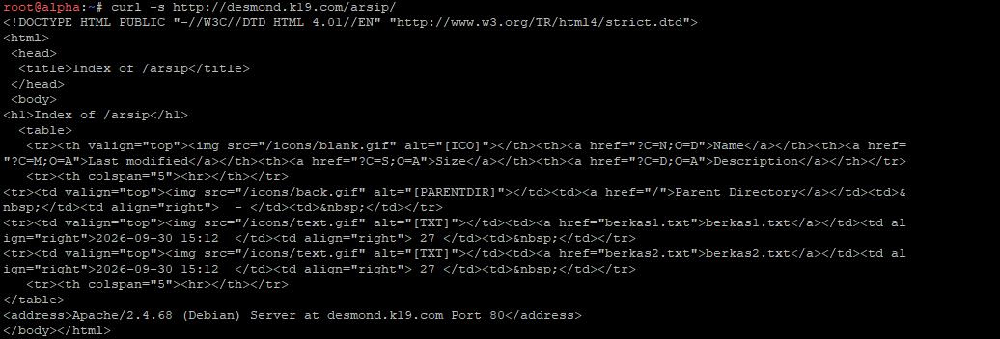 <br>
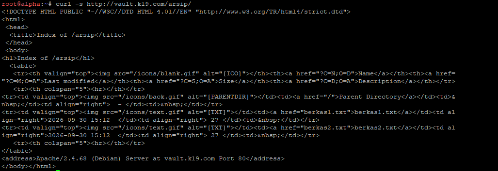 <br>
## Soal 10
Pertama lakukan konfigurasi di Oblada
```bash
apt update -o Acquire::ForceIPv4=true
apt install nginx php-fpm -y -o Acquire::ForceIPv4=true
service php$(ls /etc/php/ 2>/dev/null | tail -n 1)-fpm start 2>/dev/null || service php-fpm start 2>/dev/null || true

mkdir -p /var/www/html
echo "PD9waHAKZWNobyAiSGFsYW1hbiBQcm9maWwgRW50aXRhcyAtIE9CTEFEQS4gTm9kZTogb2JsYWRhLmsxOS5jb20gKDEwLjczLjEwLjYpXG4iOzsgCj8+" | base64 -d > /var/www/html/profil.php
chmod 644 /var/www/html/profil.php

nginx -t
service nginx restart
```
Kemudian lakukan konfigurasi di Molly
```bash
apt update -o Acquire::ForceIPv4=true
apt install nginx php-fpm -y -o Acquire::ForceIPv4=true
service php$(ls /etc/php/ 2>/dev/null | tail -n 1)-fpm start 2>/dev/null || service php-fpm start 2>/dev/null || true

mkdir -p /var/www/html
echo "PD9waHAKZWNobyAiSGFsYW1hbiBQcm9maWwgRW50aXRhcyAtIE1PTExZLiogTm9kZTogbW9sbHkuazE5LmNvbSAoMTAuNzMuMTAuNylcbiI7Owo/Pg==" | base64 -d > /var/www/html/profil.php
chmod 644 /var/www/html/profil.php

nginx -t
service nginx restart
```
Terakhir lakukan testing di node Alpha
```bash
curl http://oblada.k19.com/profil
curl http://molly.k19.com/profil
curl http://core.k19.com/profil
```
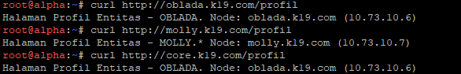<br>
## Soal 11
Penny (Apache2) dan Abbey (Nginx) dikonfigurasi sebagai reverse proxy. Penny meneruskan request ke area vault (Obladi dan Desmond), dan Abbey meneruskan ke area core (Oblada dan Molly). Keduanya meneruskan header Host dan IP asli pengunjung supaya server backend tetap tahu alamat yang diminta dan siapa pengunjungnya
Pertama lakukan konfigurasi di Penny (Apache2, proxy ke vault)
```bash
apt update -o Acquire::ForceIPv4=true
apt install apache2 -y -o Acquire::ForceIPv4=true

a2enmod proxy proxy_http proxy_balancer lbmethod_byrequests headers
a2dissite 000-default 2>/dev/null

cat << 'XEOF' > /etc/apache2/sites-available/10-www.conf
<VirtualHost *:80>
    ServerName www.k19.com

    ProxyRequests Off
    ProxyPreserveHost On
    RequestHeader set X-Real-IP expr=%{REMOTE_ADDR}

    <Proxy "balancer://vault">
        BalancerMember http://10.73.10.4:80
        BalancerMember http://10.73.10.5:80
        ProxySet lbmethod=byrequests
    </Proxy>

    ProxyPass        "/" "balancer://vault/"
    ProxyPassReverse "/" "balancer://vault/"
</VirtualHost>
XEOF

a2ensite 10-www
apachectl configtest
service apache2 restart
```
`ProxyPreserveHost On` meneruskan header `Host` asli, `RequestHeader set X-Real-IP` mengirim IP pengunjung, dan `X-Forwarded-For` ditambahkan otomatis oleh `mod_proxy`. `balancer://vault` membagi request ke Obladi dan Desmond secara bergantian.

Kemudian lakukan konfigurasi di Abbey (Nginx, proxy ke core)
```bash
apt update -o Acquire::ForceIPv4=true
apt install nginx -y -o Acquire::ForceIPv4=true

rm -f /etc/nginx/sites-enabled/default

cat << 'XEOF' > /etc/nginx/sites-available/reverse-proxy
upstream core {
    server 10.73.10.6:80;
    server 10.73.10.7:80;
}

server {
    listen 80;
    server_name static.k19.com;

    location / {
        proxy_pass http://core;
        proxy_set_header Host $host;
        proxy_set_header X-Real-IP $remote_addr;
        proxy_set_header X-Forwarded-For $proxy_add_x_forwarded_for;
    }
}
XEOF

ln -sf /etc/nginx/sites-available/reverse-proxy /etc/nginx/sites-enabled/reverse-proxy
nginx -t
pgrep -x nginx > /dev/null && nginx -s reload || nginx
```
`upstream core` berisi Oblada dan Molly, dan tiga baris `proxy_set_header` meneruskan `Host` serta IP asli pengunjung ke backend.

Terakhir lakukan testing di node Alpha
```bash
for i in 1 2 3 4 5 6; do curl -s -o /dev/null -w "%{http_code}\n" http://www.k19.com/arsip/; done
curl -s http://static.k19.com/profil
```
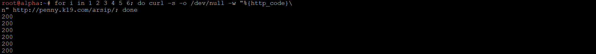
## Soal 12
meminta halaman `/admin` di Penny hanya bisa dibuka oleh pengguna yang punya kredensial. Caranya memakai *Basic Authentication*
Pertama lakukan konfigurasi di Penny (Apache2)
```bash
apt install apache2-utils -y -o Acquire::ForceIPv4=true
a2enmod authn_file auth_basic authz_user

htpasswd -b -c /etc/apache2/.htpasswd prabs 'pakar_pinter_jadi_gob***'

cat << 'XEOF' > /etc/apache2/sites-available/10-www.conf
<VirtualHost *:80>
    ServerName www.k19.com

    ProxyRequests Off
    ProxyPreserveHost On
    RequestHeader set X-Real-IP expr=%{REMOTE_ADDR}

    <Location "/admin">
        AuthType Basic
        AuthName "Admin Area"
        AuthUserFile /etc/apache2/.htpasswd
        Require valid-user
    </Location>

    <Proxy "balancer://vault">
        BalancerMember http://10.73.10.4:80
        BalancerMember http://10.73.10.5:80
        ProxySet lbmethod=byrequests
    </Proxy>

    ProxyPass        "/" "balancer://vault/"
    ProxyPassReverse "/" "balancer://vault/"
</VirtualHost>
XEOF

apachectl configtest
service apache2 restart
```
`htpasswd` menyimpan username dan password (terenkripsi) ke file `/etc/apache2/.htpasswd`. Blok `<Location "/admin">` mewajibkan login untuk semua akses ke `/admin`, dan `Require valid-user` hanya mengizinkan user yang ada di file tersebut.

Kemudian siapkan halaman tujuan di Obladi
```bash
mkdir -p /var/www/html/admin
echo "Halaman Admin Vault - obladi" > /var/www/html/admin/index.html
```
Lalu di Desmond
```bash
mkdir -p /var/www/html/admin
echo "Halaman Admin Vault - desmond" > /var/www/html/admin/index.html
```
Halaman ini disiapkan supaya setelah berhasil login, pengunjung melihat isi halaman admin dari vault, bukan error 404.

Terakhir lakukan testing di node Alpha
```bash
curl -sI http://www.k19.com/admin/ | head -1
curl -sI -u 'prabs:pakar_pinter_jadi_gob***' http://www.k19.com/admin/ | head -1
curl -sI -u 'prabs:salah' http://www.k19.com/admin/ | head -1
```
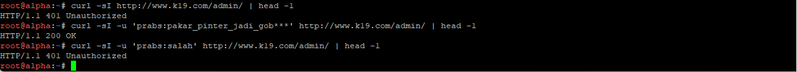
## Soal 13
Meminta semua akses ke Penny dialihkan permanen ke www, dan semua akses ke Abbey dialihkan sementara ke static
Pertama lakukan konfigurasi di Penny (Apache2)
```bash
cat << 'XEOF' > /etc/apache2/sites-available/00-redirect.conf
<VirtualHost *:80>
    ServerName penny.k19.com
    Redirect permanent / http://www.k19.com/
</VirtualHost>
XEOF

a2ensite 00-redirect
apachectl configtest
service apache2 restart
```
Kemudian lakukan konfigurasi di Abbey (Nginx)
```bash
cat << 'XEOF' > /etc/nginx/sites-available/reverse-proxy
upstream core {
    server 10.73.10.6:80;
    server 10.73.10.7:80;
}

server {
    listen 80 default_server;
    server_name abbey.k19.com _;
    return 302 http://static.k19.com$request_uri;
}

server {
    listen 80;
    server_name static.k19.com;

    location / {
        proxy_pass http://core;
        proxy_set_header Host $host;
        proxy_set_header X-Real-IP $remote_addr;
        proxy_set_header X-Forwarded-For $proxy_add_x_forwarded_for;
    }
}
XEOF

nginx -t
nginx -s reload
```
Terakhir lakukan testing di node Alpha
```bash
curl -I http://10.73.30.2/
curl -I http://penny.k19.com/
curl -I http://10.73.20.2/
curl -I http://abbey.k19.com/
```
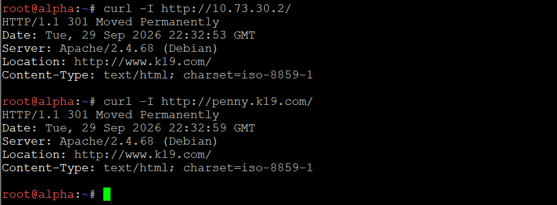
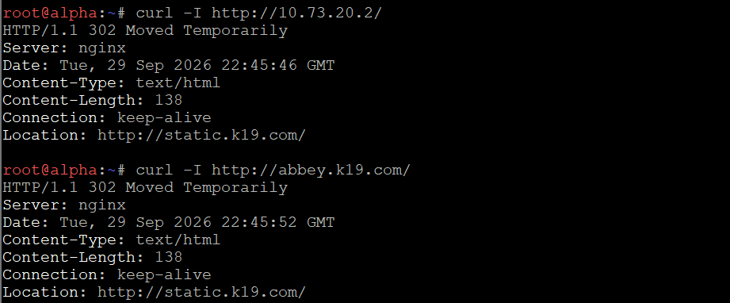
## Soal 14
Meminta log di server backend mencatat IP asli pengunjung, bukan IP proxy.
Pertama lakukan konfigurasi di Obladi dan Desmond (Apache2)
```bash
a2enmod remoteip

cat << 'XEOF' > /etc/apache2/conf-available/remoteip.conf
RemoteIPHeader X-Real-IP
RemoteIPInternalProxy 10.73.30.2
XEOF
a2enconf remoteip

if ! grep -rqs "proxy.log" /etc/apache2/sites-enabled /etc/apache2/conf-enabled; then
cat << 'XEOF' > /etc/apache2/conf-available/proxylog.conf
LogFormat "%a host=%{Host}i real=%{X-Real-IP}i xff=%{X-Forwarded-For}i" proxylog
CustomLog ${APACHE_LOG_DIR}/proxy.log proxylog
XEOF
a2enconf proxylog
fi

apachectl configtest
service apache2 restart
```
Kemudian lakukan konfigurasi di Oblada dan Molly (Nginx)
```bash
# Cek dulu isi aslinya: cat /etc/nginx/sites-available/default
cat << 'XEOF' > /etc/nginx/conf.d/proxylog.conf
log_format proxylog '$remote_addr host=$host real=$http_x_real_ip xff=$http_x_forwarded_for';
XEOF

cat << 'XEOF' > /etc/nginx/sites-available/default
server {
    listen 80 default_server;
    root /var/www/html;
    index index.php index.html;

    set_real_ip_from 10.73.20.2;
    real_ip_header X-Real-IP;
    access_log /var/log/nginx/access.log;
    access_log /var/log/nginx/proxy.log proxylog;

    location = /profil {
        rewrite ^ /profil.php last;
    }
    location ~ \.php$ {
        include snippets/fastcgi-php.conf;
        fastcgi_pass unix:/run/php/php8.4-fpm.sock;
    }
}
XEOF

nginx -t
service nginx restart
```
Terakhir lakukan testing di node Alpha, lalu cek log di backend
```bash
# Alpha
curl -s -o /dev/null http://www.k19.com/arsip/
curl -s -o /dev/null http://static.k19.com/profil

# Obladi dan Desmond
tail -n 3 /var/log/apache2/access.log
tail -n 3 /var/log/apache2/proxy.log

# Oblada dan Molly
tail -n 3 /var/log/nginx/access.log
tail -n 3 /var/log/nginx/proxy.log
```
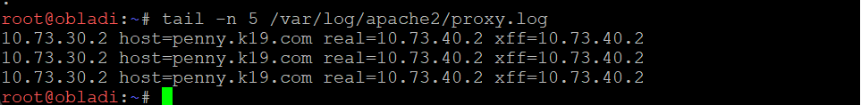

## Soal 15
Meminta dua jalur khusus. Di Penny ada /eternal yang bisa menjalankan PHP, dan di Abbey ada /orion yang murni statis.
Pertama lakukan konfigurasi di Penny (Apache2 + PHP-FPM)
```bash
apt install php8.4-fpm -y -o Acquire::ForceIPv4=true
a2enmod proxy_fcgi

mkdir -p /var/www/eternal
cat << 'XEOF' > /var/www/eternal/index.php
<?php echo "Eternal - PHP aktif, versi " . PHP_VERSION . "\n"; ?>
XEOF

cat << 'XEOF' > /etc/apache2/sites-available/10-www.conf
<VirtualHost *:80>
    ServerName www.k19.com

    ProxyRequests Off
    ProxyPreserveHost On
    RequestHeader set X-Real-IP expr=%{REMOTE_ADDR}

    Alias /eternal /var/www/eternal
    <Directory /var/www/eternal>
        Options -Indexes +FollowSymLinks
        AllowOverride None
        Require all granted
        DirectoryIndex index.php index.html
        <FilesMatch "\.php$">
            SetHandler "proxy:unix:/run/php/php8.4-fpm.sock|fcgi://localhost"
        </FilesMatch>
    </Directory>

    <Location "/admin">
        AuthType Basic
        AuthName "Admin Area"
        AuthUserFile /etc/apache2/.htpasswd
        Require valid-user
    </Location>

    <Proxy "balancer://vault">
        BalancerMember http://10.73.10.4:80
        BalancerMember http://10.73.10.5:80
        ProxySet lbmethod=byrequests
    </Proxy>

    ProxyPass        "/eternal" "!"
    ProxyPass        "/" "balancer://vault/"
    ProxyPassReverse "/" "balancer://vault/"
</VirtualHost>
XEOF

php-fpm8.4 -D
apachectl configtest
service apache2 restart
```
Kemudian lakukan konfigurasi di Abbey (Nginx)
```bash
mkdir -p /var/www/orion
echo "Orion - halaman statis" > /var/www/orion/index.html
echo '<?php echo "PHP TIDAK boleh dieksekusi di sini\n"; ?>' > /var/www/orion/test.php

cat << 'XEOF' > /etc/nginx/sites-available/reverse-proxy
upstream core {
    server 10.73.10.6:80;
    server 10.73.10.7:80;
}

server {
    listen 80 default_server;
    server_name abbey.k19.com _;
    return 302 http://static.k19.com$request_uri;
}

server {
    listen 80;
    server_name static.k19.com;

    location = /orion { return 301 /orion/; }
    location /orion/ {
        alias /var/www/orion/;
        index index.html;
    }

    location / {
        proxy_pass http://core;
        proxy_set_header Host $host;
        proxy_set_header X-Real-IP $remote_addr;
        proxy_set_header X-Forwarded-For $proxy_add_x_forwarded_for;
    }
}
XEOF

nginx -t
nginx -s reload
```
Terakhir lakukan testing di node Alpha
```bash
curl -s http://www.k19.com/eternal/ | head -3
curl -i http://static.k19.com/orion/
curl -i http://static.k19.com/orion/test.php
```
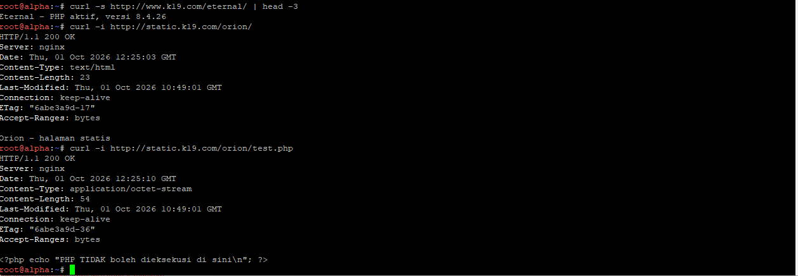
## Soal 16
Meminta uji beban memakai ApacheBench dari Alpha: 250 request dengan 10 sekaligus, ke www dan static. Tujuannya melihat apakah reverse proxy kita tetap stabil saat banyak pengunjung."
Lakukan di node Alpha
```bash
apt install apache2-utils -y -o Acquire::ForceIPv4=true
ab -n 250 -c 10 http://www.k19.com/
ab -n 250 -c 10 http://static.k19.com/
```
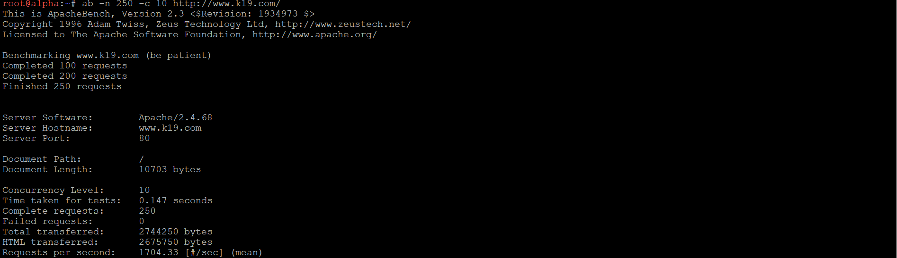
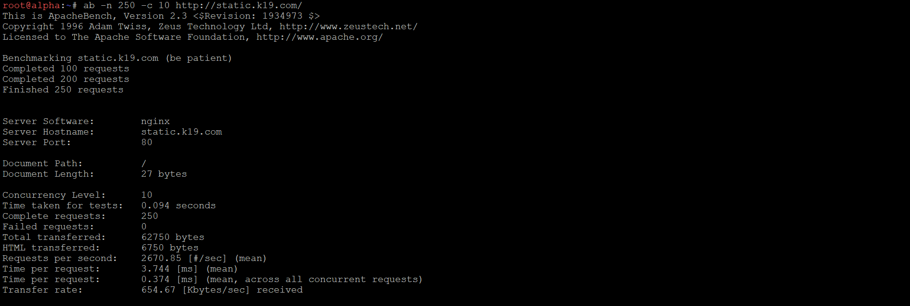
## Soal 17
Meminta DNS menjawab query TXT untuk node klien dengan nama host-nya masing-masing.
Lakukan konfigurasi di Prab
```bash
ZONE=/etc/bind/jarkom/k19.com
for h in alpha beta gamma delta epsilon; do
  sed -i -E "/^${h}[[:space:]]+IN[[:space:]]+TXT/d" $ZONE
  echo "${h}   IN      TXT     \"${h}\"" >> $ZONE
done
sleep 1
CUR=$(grep -m1 ';[[:space:]]*Serial' $ZONE | awk '{print $1}')
NEW=$(date +%y%m%d%H%M)
[ "$NEW" -le "$CUR" ] && NEW=$((CUR+1))
sed -i -E "s/^([[:space:]]*)${CUR}([[:space:]]*;[[:space:]]*Serial)/\1${NEW}\2/" $ZONE
chown -R bind:bind /etc/bind/jarkom
named-checkzone k19.com $ZONE
rndc reload k19.com > /dev/null 2>&1 || { pkill named; sleep 1; named -u bind; sleep 1; }
rndc notify k19.com > /dev/null 2>&1
sleep 3
```
Terakhir lakukan testing di node Alpha
```bash
for h in alpha beta gamma delta epsilon; do dig TXT $h.k19.com +short; done
```
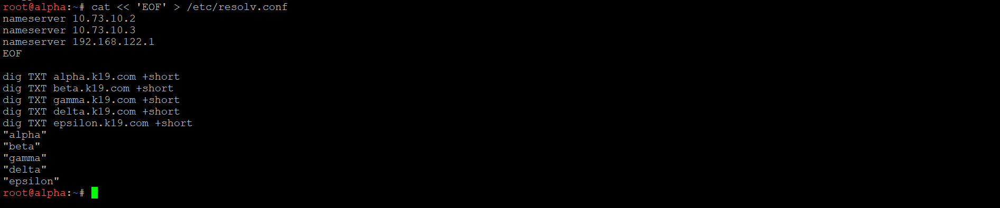
## Soal 18
Membuktikan cara kerja cache dan TTL di DNS. Kita ubah IP abbey ke IP palsu, lalu lihat bahwa jawaban DNS tidak langsung berubah selama TTL 15 detik masih berlaku
Lakukan di Prab
```bash
apt update -o Acquire::ForceIPv4=true
apt install dnsmasq -y -o Acquire::ForceIPv4=true

ZONE=/etc/bind/jarkom/k19.com
IP_LAMA=10.73.20.2
IP_BARU=10.73.99.99

naik_serial() {
  CUR=$(grep -m1 ';[[:space:]]*Serial' $ZONE | awk '{print $1}')
  NEW=$(date +%y%m%d%H%M)
  [ "$NEW" -le "$CUR" ] && NEW=$((CUR+1))
  sed -i -E "s/^([[:space:]]*)${CUR}([[:space:]]*;[[:space:]]*Serial)/\1${NEW}\2/" $ZONE
}

reload_zona() {
  named-checkzone k19.com $ZONE
  rndc reload k19.com > /dev/null 2>&1 || { pkill named; sleep 1; named -u bind; sleep 1; }
  rndc notify k19.com > /dev/null 2>&1
  sleep 2
}

# Resolver cache lokal (prab authoritative, jadi cache dibuat dengan dnsmasq port 5353)
pkill dnsmasq 2>/dev/null; sleep 1
dnsmasq --conf-file=/dev/null --port=5353 --listen-address=127.0.0.1 \
  --bind-interfaces --no-resolv --no-hosts --server=127.0.0.1#53 --cache-size=500

# TTL 15 detik dengan IP lama
sed -i -E "s/^abbey[[:space:]].*/abbey   15      IN      A       ${IP_LAMA}/" $ZONE
naik_serial
reload_zona

echo "=== KONDISI 1: sebelum perubahan (harus IP lama $IP_LAMA) ==="
dig @127.0.0.1 -p 5353 abbey.k19.com +noall +answer
T0=$(date +%s)

echo ""
echo ">>> Mengubah abbey.k19.com menjadi $IP_BARU (TTL 15 detik)"
sed -i -E "s/^abbey[[:space:]].*/abbey   15      IN      A       ${IP_BARU}/" $ZONE
naik_serial
reload_zona

echo ""
echo "=== KONDISI 2: jeda < 15 detik (harus MASIH IP lama karena cache) ==="
echo "Selisih sejak cache terisi: $(( $(date +%s) - T0 )) detik"
dig @127.0.0.1 -p 5353 abbey.k19.com +noall +answer

echo ""
echo "=== SINKRONISASI TEDD ==="
SPRAB=$(dig @10.73.10.2 k19.com SOA +short | awk '{print $3}')
STEDD=$(dig @10.73.10.3 k19.com SOA +short | awk '{print $3}')
echo "Serial prab: $SPRAB | Serial tedd: $STEDD"
echo "abbey di tedd: $(dig @10.73.10.3 abbey.k19.com +short)"

# Tunggu sampai TTL habis (>= 16 detik sejak cache terisi)
SISA=$(( 16 - ( $(date +%s) - T0 ) ))
[ "$SISA" -gt 0 ] && sleep $SISA

echo ""
echo "=== KONDISI 3: setelah TTL 15 detik habis (harus IP fiktif $IP_BARU) ==="
echo "Selisih sejak cache terisi: $(( $(date +%s) - T0 )) detik"
dig @127.0.0.1 -p 5353 abbey.k19.com +noall +answer

pkill dnsmasq
```
Setelah pengujian, kembalikan A record abbey ke IP normal (di Prab)
```bash
ZONE=/etc/bind/jarkom/k19.com
sed -i -E "s/^abbey[[:space:]].*/abbey   IN      A       10.73.20.2/" $ZONE
sleep 1
CUR=$(grep -m1 ';[[:space:]]*Serial' $ZONE | awk '{print $1}')
NEW=$(date +%y%m%d%H%M)
[ "$NEW" -le "$CUR" ] && NEW=$((CUR+1))
sed -i -E "s/^([[:space:]]*)${CUR}([[:space:]]*;[[:space:]]*Serial)/\1${NEW}\2/" $ZONE
named-checkzone k19.com $ZONE
rndc reload k19.com > /dev/null 2>&1 || { pkill named; sleep 1; named -u bind; sleep 1; }
rndc notify k19.com > /dev/null 2>&1
sleep 3
echo -n "prab: "; dig @10.73.10.2 abbey.k19.com +short
echo -n "tedd: "; dig @10.73.10.3 abbey.k19.com +short
```
Terakhir lakukan testing di node Alpha
```bash
dig abbey.k19.com +short
curl -I http://abbey.k19.com/
```


## Soal 19
Meminta nama internal outbound.k19.com dibuat sebagai alias ke domain di internet, yaitu http.badssl.com. J
Lakukan konfigurasi di Prab
```bash
ZONE=/etc/bind/jarkom/k19.com
sed -i -E '/^outbound[[:space:]]/d' $ZONE
echo "outbound        IN      CNAME   http.badssl.com." >> $ZONE
sleep 1
CUR=$(grep -m1 ';[[:space:]]*Serial' $ZONE | awk '{print $1}')
NEW=$(date +%y%m%d%H%M)
[ "$NEW" -le "$CUR" ] && NEW=$((CUR+1))
sed -i -E "s/^([[:space:]]*)${CUR}([[:space:]]*;[[:space:]]*Serial)/\1${NEW}\2/" $ZONE
named-checkzone k19.com $ZONE
rndc reload k19.com > /dev/null 2>&1 || { pkill named; sleep 1; named -u bind; sleep 1; }
rndc notify k19.com > /dev/null 2>&1
sleep 3
echo -n "Serial prab: "; dig @10.73.10.2 k19.com SOA +short | awk '{print $3}'
echo -n "Serial tedd: "; dig @10.73.10.3 k19.com SOA +short | awk '{print $3}'
dig @10.73.10.2 outbound.k19.com +short
dig @10.73.10.3 outbound.k19.com +short
```
Terakhir lakukan testing di node Alpha
```bash
dig outbound.k19.com +short
curl -I http://outbound.k19.com/
curl -s http://outbound.k19.com/ | grep -i title
curl -s -H "Host: http.badssl.com" http://outbound.k19.com/ | grep -i title
curl -s -H "Host: http.badssl.com" http://outbound.k19.com/
```
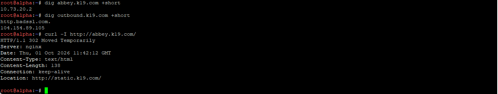
## Soal 20
Meminta semua service dan aturan NAT berjalan otomatis setelah node di-restart.
Pertama lakukan konfigurasi di Prab
```bash
cat << 'XEOF' > /root/init.sh
#!/bin/bash
# prab - autostart BIND9
pgrep -x named > /dev/null || named -u bind
XEOF
chmod +x /root/init.sh
```
Kemudian di Tedd
```bash
cat << 'XEOF' > /root/init.sh
#!/bin/bash
# tedd - autostart BIND9
pgrep -x named > /dev/null || named -u bind
XEOF
chmod +x /root/init.sh
```
Lalu di Obladi dan Desmond
```bash
cat << 'XEOF' > /root/init.sh
#!/bin/bash
# vault - autostart Apache2
pgrep -x apache2 > /dev/null || service apache2 start
XEOF
chmod +x /root/init.sh
```
Di Penny
```bash
cat << 'XEOF' > /root/init.sh
#!/bin/bash
# penny - autostart PHP-FPM + Apache2
pgrep -x php-fpm8.4 > /dev/null || php-fpm8.4 -D
pgrep -x apache2 > /dev/null || service apache2 start
XEOF
chmod +x /root/init.sh
```
Di Oblada dan Molly
```bash
cat << 'XEOF' > /root/init.sh
#!/bin/bash
# core - autostart PHP-FPM + Nginx
pgrep -x php-fpm8.4 > /dev/null || php-fpm8.4 -D
pgrep -x nginx > /dev/null || nginx
XEOF
chmod +x /root/init.sh
```
Di Abbey
```bash
cat << 'XEOF' > /root/init.sh
#!/bin/bash
# abbey - autostart Nginx
pgrep -x nginx > /dev/null || nginx
XEOF
chmod +x /root/init.sh
```
Di Rootkit
```bash
cat << 'XEOF' > /root/init.sh
#!/bin/bash
# rootkit - IP gateway + routing + NAT (idempotent)
for i in 0 1 2 3 4 5; do ip link set eth$i up; done
ip addr add 10.73.10.1/24 dev eth1 2>/dev/null || true
ip addr add 10.73.20.1/24 dev eth2 2>/dev/null || true
ip addr add 10.73.30.1/24 dev eth3 2>/dev/null || true
ip addr add 10.73.40.1/24 dev eth4 2>/dev/null || true
ip addr add 10.73.50.1/24 dev eth5 2>/dev/null || true

echo 1 > /proc/sys/net/ipv4/ip_forward
iptables -t nat -C POSTROUTING -o eth0 -j MASQUERADE 2>/dev/null || iptables -t nat -A POSTROUTING -o eth0 -j MASQUERADE
iptables -C FORWARD -j ACCEPT 2>/dev/null || iptables -A FORWARD -j ACCEPT
XEOF
chmod +x /root/init.sh
```
Pengembalian A record abbey ke IP normal (di Prab)
```bash
ZONE=/etc/bind/jarkom/k19.com
sed -i -E "s/^abbey[[:space:]].*/abbey   IN      A       10.73.20.2/" $ZONE
sleep 1
CUR=$(grep -m1 ';[[:space:]]*Serial' $ZONE | awk '{print $1}')
NEW=$(date +%y%m%d%H%M)
[ "$NEW" -le "$CUR" ] && NEW=$((CUR+1))
sed -i -E "s/^([[:space:]]*)${CUR}([[:space:]]*;[[:space:]]*Serial)/\1${NEW}\2/" $ZONE
named-checkzone k19.com $ZONE
rndc reload k19.com > /dev/null 2>&1 || { pkill named; sleep 1; named -u bind; sleep 1; }
rndc notify k19.com > /dev/null 2>&1
sleep 3
echo -n "prab: "; dig @10.73.10.2 abbey.k19.com +short
echo -n "tedd: "; dig @10.73.10.3 abbey.k19.com +short
```
Terakhir lakukan pengujian setelah setiap node di-restart
```bash
# Prab dan Tedd
pgrep -a named; dig @127.0.0.1 k19.com SOA +short
# Obladi, Desmond, Penny
pgrep -a apache2 | head -2
# Penny, Oblada, Molly
pgrep -a php-fpm | head -2
# Oblada, Molly, Abbey
pgrep -a nginx | head -2
# Rootkit
cat /proc/sys/net/ipv4/ip_forward; iptables -t nat -L POSTROUTING -n

# Alpha
dig abbey.k19.com +short
dig outbound.k19.com +short
curl -I http://www.k19.com/
curl -I http://abbey.k19.com/
curl -s http://www.k19.com/eternal/ | head -3
curl -I http://http.badssl.com/
```
